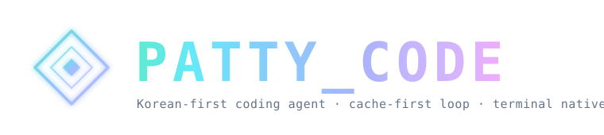

<p align="center">
  
</p>

<p align="center">
  <strong>한국어</strong>
  &nbsp;·&nbsp;
  <a href="./README.en.md">English</a>
  &nbsp;·&nbsp;
  <a href="https://code.patty.io">웹사이트</a>
  &nbsp;·&nbsp;
  <a href="./docs/GUIDE.ko-KR.md">가이드</a>
  &nbsp;·&nbsp;
  <a href="https://github.com/patrickrho-patty/patty-code/releases">릴리스</a>
</p>

<p align="center">
  <a href="https://github.com/patrickrho-patty/patty-code/actions/workflows/ci.yml"></a>
  <a href="https://www.npmjs.com/package/patty-code"></a>
  <a href="./LICENSE"></a>
</p>

<h3 align="center">한국어로 생각하고, 터미널에서 끝까지 일하는 코딩 에이전트.</h3>

<p align="center">
  Patty Code는 한국어를 기본 언어로 설계한 오픈소스 코딩 에이전트 하네스입니다.<br/>
  선명한 TUI, 통제 가능한 자율 실행, 교체 가능한 모델과 도구를 하나의 로컬 런타임에 담았습니다.
</p>

```text
╭─ Patty Code ───────────────────────────────────────────────────╮
│  [ 작업 자동 ]  [ 모델 medium ]  [ 추론 자동 ]  [ 여유 100% ]  │
╰────────────────────────────────────────────────────────────────╯

                 태극기  ·  PATTY 작업 흐름

╭─ 메시지 입력 ──────────────────────────────────────────────────╮
│   명령 또는 질문을 입력해보세요                                │
╰────────────────────────────────────────────────────────────────╯
             대기 · Shift+Tab 일반/자동/계획 · Ctrl+Y YOLO
```

## Patty Code가 다른 점

- **한국어가 기본값입니다.** TUI, 도움말, 오류, 설정 흐름과 내장 명령이 한국어에서 먼저 자연스럽게 읽히도록 구성되어 있습니다.
- **한국어 입력을 제품 기능으로 다룹니다.** CJK 문자 경계, IME 조합, 커서 이동과 삭제 동작을 별도 호환성 경로와 회귀 테스트로 관리합니다.
- **자체적인 터미널 인터페이스가 있습니다.** 제목 표시줄, 경계가 분명한 상태 지표, 중앙 정렬된 태극기와 Patty 마크, 둥근 입력 프레임, 자연스러운 시작 높이와 의미 기반 색상 테마를 제공합니다.
- **한국어 명령을 바로 찾을 수 있습니다.** 한국어 명령명, 영어 이름과 초성 별칭을 함께 검색하며, 애매한 입력은 자동 실행하지 않습니다.
- **자율성의 범위를 사용자가 결정합니다.** 일반, 자동, 계획 모드와 권한 규칙, 샌드박스, 체크포인트, 되감기, 세션 복구가 긴 작업을 통제 가능한 상태로 유지합니다.
- **하네스가 모델보다 오래갑니다.** Provider, MCP 서버, Skills, 플러그인, 서브에이전트와 ACP 클라이언트를 같은 런타임에 연결할 수 있습니다.
- **기능을 마켓플레이스에서 확장합니다.** 플러그인 마켓플레이스에서 패키지를 찾고 설치할 수 있으며, HWPX 플러그인으로 한국어 문서를 같은 작업 흐름 안에서 읽고 분석할 수 있습니다.

## 빠른 시작

### npm으로 설치

Node.js 18 이상이 필요합니다. 설치 시 현재 운영체제와 아키텍처에 맞는 네이티브 `patcode` 바이너리를 받습니다.

```sh
npm i -g patty-code
patcode setup
patcode
```

### 릴리스 바이너리 사용

[GitHub Releases](https://github.com/patrickrho-patty/patty-code/releases)에서 macOS, Linux, Windows용 아카이브와 체크섬을 받을 수 있습니다.

### 소스에서 빌드

```sh
git clone https://github.com/patrickrho-patty/patty-code.git
cd patty-code
make build
./bin/patcode setup
./bin/patcode
```

`make cross`는 `darwin|linux|windows × amd64|arm64` 여섯 개 CLI 빌드를 `dist/`에 생성합니다.

## 기본 런타임

새 설치는 Patty가 관리하는 단일 모델 구성으로 시작합니다.

| 항목 | 기본값 |
| --- | --- |
| 모델 참조 | `patty/medium` |
| 표시 이름 | `medium` |
| API | `https://omni.agents.patty.io/v1` |
| 컨텍스트 창 | `248124` 토큰 |
| 자동 압축 시작 | `238123` 토큰 (`95.96935403266109%`) |
| 강제 압축 | `98%` |
| 자격 증명 이름 | `AGENTS_PATTY_API_KEY` |

`patcode setup`은 키를 Patty Code 자격 증명 저장소에 보관합니다. 기본 모델 선택기에는 `medium`만 표시되며, 다른 OpenAI 호환 Provider는 사용자가 명시적으로 추가할 수 있습니다.

## 사용하는 방법

```sh
patcode                                      # 대화형 TUI
patcode -p "이 저장소의 구조를 요약해줘"     # 한 번 실행하고 결과 출력
patcode run "실패하는 테스트의 원인을 찾아줘" # 헤드리스 작업
patcode run --auto "수정하고 검증해줘"        # 무인 쓰기를 명시적으로 허용
patcode acp                                  # ACP 호스트/에디터 연결
patcode serve                                # HTTP + SSE 서버
```

대화형 TUI에서는 `/모델전환`, `/작업모드`, `/테마전환`, `/언어설정`, `/도움말` 같은 한국어 명령을 사용할 수 있습니다. `/`를 입력하면 명령 팔레트가 열리고, `@`는 파일, `!`는 셸 입력을 시작합니다.

## 하나의 런타임, 여러 표면

| 표면 | 용도 |
| --- | --- |
| CLI / TUI | 저장소 안에서 대화하고 도구 실행을 승인하는 기본 환경 |
| Headless | 스크립트, CI와 반복 가능한 자동화용 `run`/`-p` 경로 |
| Desktop | 로컬 런타임을 사용하는 그래픽 작업 공간과 설정 UI |
| ACP | 호환 에디터와 호스트가 Patty Code 세션을 직접 구동하는 stdio 프로토콜 |
| Serve | 브라우저나 원격 클라이언트를 위한 HTTP + SSE 인터페이스 |

모든 표면은 같은 Provider 구성, 권한 모델, 세션 기록과 확장 시스템을 공유합니다.

## 플러그인 마켓플레이스와 HWPX

플러그인 패키지는 Skills, 에이전트, 슬래시 명령, 훅, MCP 도구와 테마를 하나의 설치 단위로 추가합니다. 마켓플레이스는 패키지의 호환성과 포함 기능을 보여준 뒤 설치하며, 설치된 패키지는 끄거나 다시 켜고 진단할 수 있습니다.

HWPX 플러그인은 마켓플레이스에 포함된 공식 Patty Code 확장입니다. `.hwpx` 문서를 읽고 분석 가능한 컨텍스트로 변환하므로, 한국어 문서 작업을 별도 변환 도구로 옮기지 않아도 됩니다.

```sh
patcode plugin list
patcode plugin show <name>
patcode plugin install <source> --dry-run
patcode plugin install <source> --yes
patcode plugin disable <name>
patcode plugin enable <name>
patcode plugin doctor <name>
```

대화형 TUI에서는 `/플러그인`, Desktop에서는 플러그인 마켓플레이스를 열어 같은 설치 상태를 관리할 수 있습니다.

## 테마

프레임은 유지하면서 색상 팔레트를 바꿀 수 있습니다. `~/.patty/config.toml`에서 설정하거나 실행 시 환경 변수로 덮어쓸 수 있습니다.

```toml
[ui]
theme = "auto"                 # auto | dark | light
theme_style = "seoul-night"    # seoul-night | ink-night | hanji-light | jade-night
```

## 문서

- [한국어 가이드](./docs/GUIDE.ko-KR.md)
- [CLI 레퍼런스](./docs/CLI.md)
- [구성 파일과 자격 증명 경로](./docs/CONFIG_PATHS.md)
- [ACP 에디터 연동](./docs/ACP.md)
- [확장과 플러그인](./docs/EXTENSIONS.ko-KR.md)
- [제품 명세](./docs/SPEC.md)
- [마이그레이션 가이드](./docs/MIGRATING.md)

## 개발

```sh
make test
make vet
make cross
```

변경을 제안하려면 [CONTRIBUTING.md](./CONTRIBUTING.md)를, 보안 문제를 제보하려면 [SECURITY.md](./SECURITY.md)를 확인하세요.

## 라이선스

Patty Code는 [MIT 라이선스](./LICENSE)로 배포됩니다.

<p align="center">
  <strong>Patty Code</strong><br/>
  <sub>한국어 퍼스트 · 터미널 네이티브 · 사용자가 통제하는 에이전트</sub>
</p>
